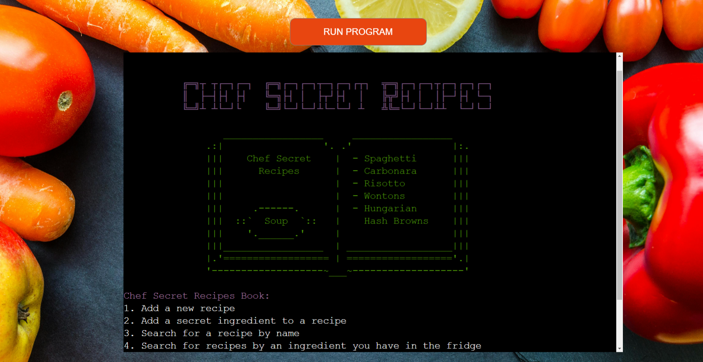
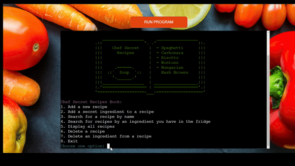
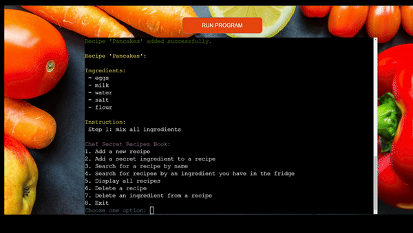
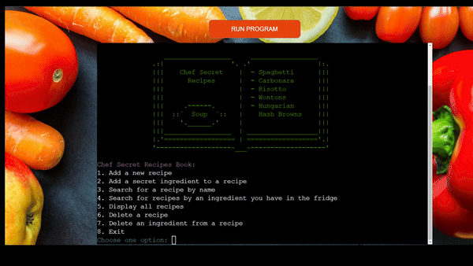
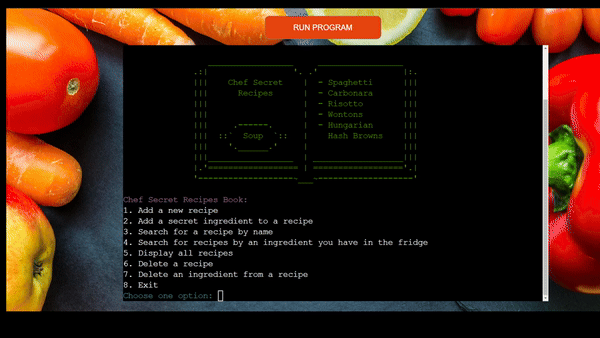
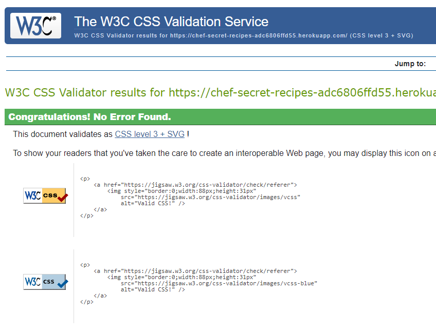
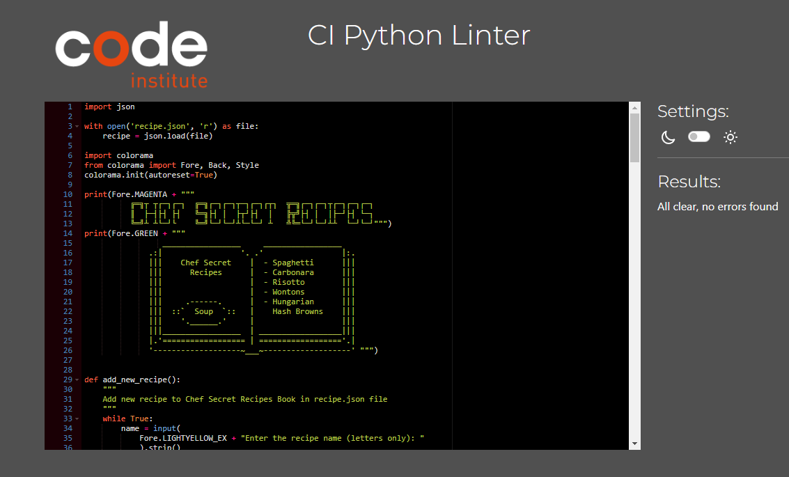

# **Chef Secret Recipes Book**

[Project live link](https://chef-secret-recipes-adc6806ffd55.herokuapp.com/)

Chef Secret Recipes Book is a Python project designed to create and organize recipes with secret ingredients that make each dish delicious, unique, and special.
This tool allows both novice and experienced chefs to add, delete, search for recipes efficiently with all data stored in a recipe.json file. 

Additionally, users can search for a recipes based on ingredients they have on hand, making it easy to decide what to cook with what is already in the fridge.

## Contents

* [User Experience (UX)](#user-experience-ux) 
* [Features](#features)
* [Design](#design)
* [Technologies Used](#technologies-used)
* [Testing](#testing)
* [Deployment](#deployment)
* [Credits](#credits)

## User Experience

- ### User Stories:

    #### 1. Adding new recipes

     * As a user, I want to create new recipes and add them to the Chef Secret Recipes Book so I can easily access them later.
     * As a user, I want to add both ingredients and instructions in each recipe so that I know what to use and how to cook.

    #### 2. Adding a secret ingredient

     * As a user and chef, I want to add a "secret ingredient" to my recipes to enhance their flavor and uniqueness.
     * As a user and chef, I want to identify which ingredient is the secret one when searching for a recipe.

    #### 3. Searching for a recipe

     * As a user, I want to search for a recipes by name so I can quickly find specific dishes in my recipe book.
     * As a user with limited ingredients, I want to search for recipes by ingredient so I can make meals with what I have in the fridge.

    #### 4. Managing Chef Secret Recipes Book

     * As a user, I want to display all available recipes in the Chef Secret Recipes.
     * As a user, I want to delete a recipes that I no longer need or have tried and did not like, so my recipe book stays organized.
     * As a user, I want to update recipes by deleting ingredients I do not like.
    
    #### 5. Data Storage

     * As a user, I want my recipes to be saved in a file (recipe.json) so that I do not lose any recipes when I close the program.
     * As a user, I want all changes to be saved automatically, so I do not need to worry about manually saving them.

    #### 6. User-friendly Interface

     * As a user, I want clear prompts when adding or searching recipes so I understand how to use each feature.
     * As a user, I want error messages when I enter invalid data (like an incorrect recipe name) so I can easily correct my input.

## Flowchart

The flowchart for Chef Secret Recipe Book visualizes the structure and main operations.

## Features

### Existing Features

####  **Main Screen**

The Main Screen displays title "Chef Secret Recipes" along with recipe book, styled using ASCII Art and redesigned in Gitpod.
The main screen introduces the program's theme and lists available options, allowing users to easily navigate the recipe book. Options include adding recipes, adding a secret ingredient, searching by name or ingredients, displaying all recipes, deleting recipe or a specific ingredient.

####  **Add New Recipe**

The Add New Recipe feature allows users to input a recipe name, ingredients, and step by step instructions. Ingredients are separated by commas, and instructions are saved as numbered steps.

 

####  **Add Secret Ingredient**

The Add Secret Ingredient feature allows users to input specific ingredient displayed with * that make the meal unique.

####  **Search Recipe by Name**

The Search by Name feature lets users search for recipes using the name, with case-insensitive matching for ease of use. If the recipe is found, the program displays the ingredients and instructions in a clean, formatted layout.

#### **Search by Ingredient Name**

Users can search recipes by entering an ingredient they have on hand. This feature also matches recipes containing "secret ingredients" that are specially marked, making it easy to discover recipes that can use up specific ingredients.

#### **Display All Recipes**

The Display All Recipes feature shows a list of all stored recipes, providing an overview of what is available in the Chef Secret Recipes Book. 

#### **Delete Recipe**

Users can delete entire recipe if no longer needed. 

#### **Delete Ingredient**

Users can delete an ingredient from the recipe if they do not want to use it.
After deleting an ingredient, the updated recipe is displayed to confirm changes.

### Future Features:

- Recipe Categories
- Ingredient Substitutions
- Meal Planner
- Shopping List Generator

## Technologies Used

### Language Used

-    [Python](https://en.wikipedia.org/wiki/Python_(programming_language))

## Content

### Frameworks, Libraries & Programs Used

## Testing

### Manual Test Cases and Results

* Testing completed on the below browser:
  - Chrome
  - Edge
  - FireFox
  - DuckDuckGo

|    | Test                        | Steps                                                                          | Expected Results                                          | Actual Results                                           | Pass/Fail | Comments                                                                                   |
| -- | --------------------------- | ------------------------------------------------------------------------------ | --------------------------------------------------------- | -------------------------------------------------------- | --------- | ------------------------------------------------------------------------------------------ |
|    |                             |                                                                                |                                                           |                                                          |           |                                                                                            |
| 1  | Invalid Option              | Choose an option number that does not exist on the Main Menu                   | Error message displayed                                   | Error message received                                   | Pass      |                                                                                            |
| 2  | Add a New Recipe            | 1\. Start the app 2\. Add a recipe with name, ingredients, and instructions | Recipe saved in recipe.json file                          | Recipe was added to json file, but disappears on restart | Fail      | Fixed by using dump() to convert dictionary into json format before saving them to a file. |
| 3  | Add Secret Ingredient       | 1\. Enter recipe name 2\. Add a secret ingredient                           | Secret ingredient is added to the recipe                  | Secret ingredient added                                  | Pass      |                                                                                            |
| 4  | Search Recipe by Name       | 1\. Enter recipe name 2\. View results                                      | Recipe with matching name is displayed                    | Recipe found and displayed                               | Pass      |                                                                                            |
| 5  | Search Recipe by Ingredient | 1\. Enter an ingredient name 2\. View results                               | Recipes containing the specified ingredient are displayed | Recipes containing ingredient are displayed              | Pass      |                                                                                            |
| 6  | Display All Recipes         | Choose option to display all available recipes                                 | List of all recipes is displayed                          | All recipes displayed                                    | Pass      |                                                                                            |
| 7  | Delete Recipe               | Enter name of recipe to delete                                                 | Selected recipe is deleted                                | Recipe deleted                                           | Pass      |                                                                                            |
| 8  | Delete Ingredient           | 1\. Enter recipe name 2\. Enter ingredient name to delete                   | Ingredient is removed from the recipe                     | Ingredient deleted                                       | Pass      |                                                                                            |
| 9  | Enter Invalid Data          | Enter invalid recipe name or ingredient                                        | Error message displayed                                   | Error message appeared                                   | Pass      |                                                                                            |
| 10 | Exit Program                | Press 8 to exit                                                                | Program closes                                            | Program closed                                           | Pass      |                                                                                            |

### Validation

- [HTML Validator](https://validator.w3.org/)

- [CSS Validator](https://jigsaw.w3.org/css-validator/)

- [Python Linter](https://pep8ci.herokuapp.com/)

- Lighthouse Testing

## Bugs

* New recipe not saved in JSON file after restarting program.
  - When adding a new recipe, everything appeared to work correctly. The recipe was added successfully. However, after restarting the program, the added recipe disappeared.

* Solution
  - To fix this bug, I used the dump() function to convert the dictionary into JSON format, before saving it to recipe.json. 

### Unfixed Bugs

* No unfixed bugs.

## Deployment

### Version Control

* The project was developed using the [Code Institute Template](https://github.com/Code-Institute-Org/p3-template), the Gitpod editor, and was pushed to GitHub in the remote repository Chef_Secret_Recipes.
* Git commands were used to push the code to the repository.

### Deployment to Heroku

* The project was deployed to Heroku with the following steps:
  - Create an account and log in to Heroku
  - Go to the dashboard, click *New*, then *Create new app*
  - Navigate to *Settings*
  - Go to *Config Vars*, click *Reveal Config Vars*, and add *PORT* as the KEY, and *8000* as the VALUE. Click *add*
  - Go to *Buildpacks*, then click *Add buildpack*, in the following order:
    - Select *python* and click *Add Buildpack*
    - Select *nodejs* and click *Add Buildpack*
  - Navigate to the *Deploy* tab at the top
  - Click *GitHub*, then *Connect to GitHub*
  - Search for the repository you want to deploy and click *connect*
  - Select *Enable Automatic Deploys* or *Deploy Branch*

[Link to deployed project](https://chef-secret-recipes-adc6806ffd55.herokuapp.com/)

### How to clone the repository

- Go to the https://github.com/Magda-R-bit/Chef_Secret_Recipes reposotory on GitHub
- Click on the Code button located above the project files
- Select HTTPS and copy the repository link
- Open your IDE, and paste the copied Git URL into the IDE terminal
- The project is now created as a local clone

## Credits

### Inspiration

