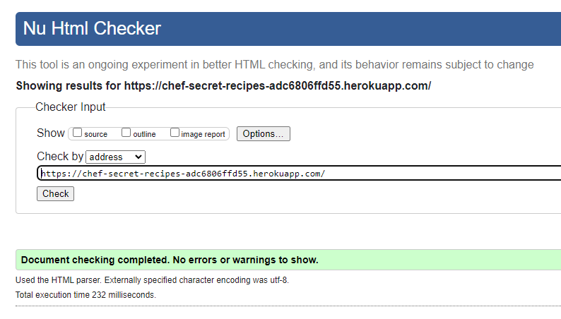

# **Chef Secret Recipes Book**

[Project live link](https://chef-secret-recipes-adc6806ffd55.herokuapp.com/)

Chef Secret Recipes Book is a Python project designed to create and organize recipes with secret ingredients that make each dish delicious, unique, and special.
This tool allows both novice and experienced chefs to add, delete, search for recipes efficiently with all data stored in a recipe.json file. 

Additionally, users can search for a recipes based on ingredients they have on hand, making it easy to decide what to cook with what is already in the fridge.

## Contents

* [User Experience (UX)](#user-experience-ux) 
* [Features](#features)
* [Design](#design)
* [Technologies Used](#technologies-used)
* [Testing](#testing)
* [Deployment](#deployment)
* [Credits](#credits)

## User Experience

- ### User Stories:

    #### 1. Adding new recipes

     * As a user, I want to create new recipes and add them to the Chef Secret Recipes Book so I can easily access them later.
     * As a user, I want to add both ingredients and instructions in each recipe so that I know what to use and how to cook.

    #### 2. Adding a secret ingredient

     * As a user and chef, I want to add a "secret ingredient" to my recipes to enhance their flavor and uniqueness.
     * As a user and chef, I want to identify which ingredient is the secret one when searching for a recipe.

    #### 3. Searching for a recipe

     * As a user, I want to search for a recipes by name so I can quickly find specific dishes in my recipe book.
     * As a user with limited ingredients, I want to search for recipes by ingredient so I can make meals with what I have in the fridge.

    #### 4. Managing Chef Secret Recipes Book

     * As a user, I want to display all available recipes in the Chef Secret Recipes.
     * As a user, I want to delete a recipes that I no longer need or have tried and did not like, so my recipe book stays organized.
     * As a user, I want to update recipes by deleting ingredients I do not like.
    
    #### 5. Data Storage

     * As a user, I want my recipes to be saved in a file (recipe.json) so that I do not lose any recipes when I close the program.
     * As a user, I want all changes to be saved automatically, so I do not need to worry about manually saving them.

    #### 6. User-friendly Interface

     * As a user, I want clear prompts when adding or searching recipes so I understand how to use each feature.
     * As a user, I want error messages when I enter invalid data (like an incorrect recipe name) so I can easily correct my input.

## Flowchart

The flowchart for Chef Secret Recipe Book visualizes the structure and main operations.

## Features

#### Existing Features

#### Future Features:

## Technologies Used

### Languages Used

-    [Python](https://en.wikipedia.org/wiki/Python_(programming_language))

## Content

### Frameworks, Libraries & Programs Used

## Testing

### Manual Test Cases and Results

* Testing completed on the below browser:
  - Chrome
  - Edge
  - FireFox
  - DuckDuckGo

|    | Test                        | Steps                                                                          | Expected Results                                          | Actual Results                                           | Pass/Fail | Comments                                                                                   |
| -- | --------------------------- | ------------------------------------------------------------------------------ | --------------------------------------------------------- | -------------------------------------------------------- | --------- | ------------------------------------------------------------------------------------------ |
|    |                             |                                                                                |                                                           |                                                          |           |                                                                                            |
| 1  | Invalid Option              | Choose an option number that does not exist on the Main Menu                   | Error message displayed                                   | Error message received                                   | Pass      |                                                                                            |
| 2  | Add a New Recipe            | 1\. Start the app 2\. Add a recipe with name, ingredients, and instructions | Recipe saved in recipe.json file                          | Recipe was added to json file, but disappears on restart | Fail      | Fixed by using dump() to convert dictionary into json format before saving them to a file. |
| 3  | Add Secret Ingredient       | 1\. Enter recipe name 2\. Add a secret ingredient                           | Secret ingredient is added to the recipe                  | Secret ingredient added                                  | Pass      |                                                                                            |
| 4  | Search Recipe by Name       | 1\. Enter recipe name 2\. View results                                      | Recipe with matching name is displayed                    | Recipe found and displayed                               | Pass      |                                                                                            |
| 5  | Search Recipe by Ingredient | 1\. Enter an ingredient name 2\. View results                               | Recipes containing the specified ingredient are displayed | Recipes containing ingredient are displayed              | Pass      |                                                                                            |
| 6  | Display All Recipes         | Choose option to display all available recipes                                 | List of all recipes is displayed                          | All recipes displayed                                    | Pass      |                                                                                            |
| 7  | Delete Recipe               | Enter name of recipe to delete                                                 | Selected recipe is deleted                                | Recipe deleted                                           | Pass      |                                                                                            |
| 8  | Delete Ingredient           | 1\. Enter recipe name 2\. Enter ingredient name to delete                   | Ingredient is removed from the recipe                     | Ingredient deleted                                       | Pass      |                                                                                            |
| 9  | Enter Invalid Data          | Enter invalid recipe name or ingredient                                        | Error message displayed                                   | Error message appeared                                   | Pass      |                                                                                            |
| 10 | Exit Program                | Press 8 to exit                                                                | Program closes                                            | Program closed                                           | Pass      |                                                                                            |

### Validation

- [HTML Validator](https://validator.w3.org/)

- [CSS Validator](https://jigsaw.w3.org/css-validator/)

- [Python Linter](https://pep8ci.herokuapp.com/)

- Lighthouse Testing

## Bugs

* New recipe not saved in JSON file after restarting program.
  - When adding a new recipe, everything appeared to work correctly. The recipe was added successfully. However, after restarting the program, the added recipe disappeared.

* Solution
  - To fix this bug, I used the dump() function to convert the dictionary into JSON format, before saving it to recipe.json. 

### Unfixed Bugs

* No unfixed bugs.

## Deployment

### Version Control

### Deployment to Heroku

### How to clone the repository

## Credits

### Inspiration

